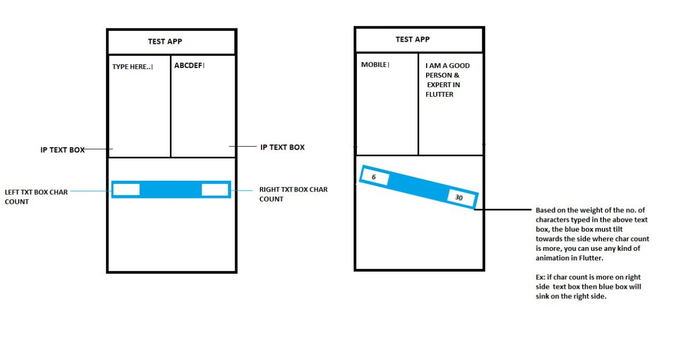
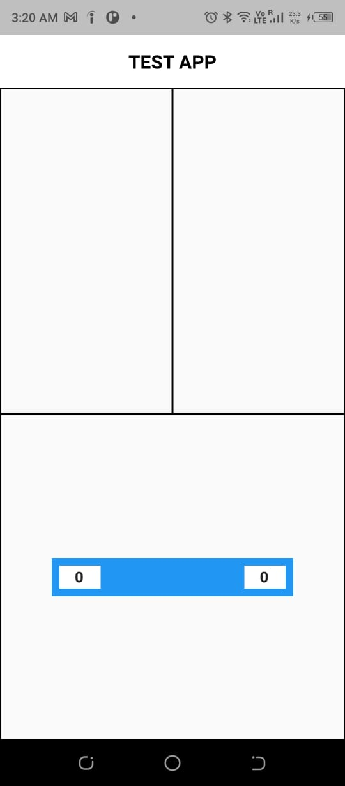
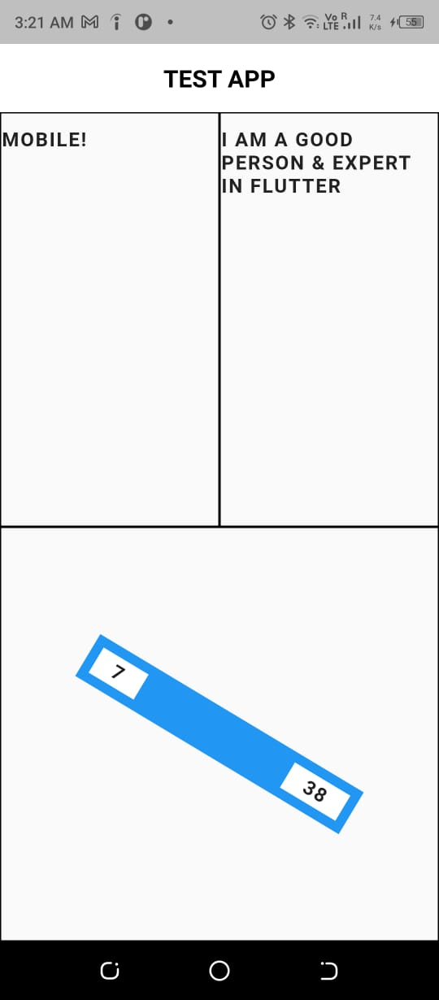

# Harivara Technical Assignment

Develop a flutter application which will change the angle of the blue box as shown in the UI [below](#output-result) based on the character length from left and right textfields.
- Rule 1: Once the bar touches the bottom it must completely reset with 0 0
- Rule 2: As the user types, kindly push the char count to firebase in real time and send the values back to the bar to make it move

# Output Result

# Result
Result 1                   |  Result 2
:-------------------------:|:-------------------------:
  |  

# Personal Details
Fields                     |  Data
:-------------------------:|:-------------------------:
Name                       |  Yash Makan
Email                      |  [yashmakan.work@gmail.com](mailto:yashmakan.work@gmail.com)
Website                    |  [yashmakan.co.in](https://yashmakan.co.in/)
Linkedin                   |  [@yashmakan](https://www.linkedin.com/in/yashmakan/)